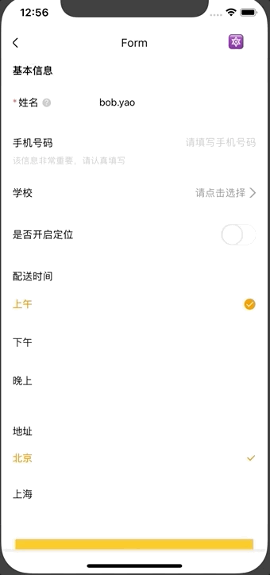

# 校验器

使用函数式组合的方式实现，可以配合 Form 组件实现表单校验功能。

## Usage

只支持按需引入。

```js
import validator from '@roo/roo-mobile-rn/dist/common/utils/validator'
```

## Examples



## Code
[详细 Code](../../examples/Form/index.tsx)

```js
const validate = validator.dispatch(
  validator.register('name', (key, value, callback) => {
    let ret = { valid: true }
    if (!value) {
      ret = {
        valid: false,
        msg: '请输入姓名'
      }
    }
    callback(ret)
  }),
  validator.register('phone', (key, value, callback) => {
    let ret = { valid: true }
    if (!value) {
      ret = {
        valid: false,
        msg: '请输入手机号码'
      }
    }
    callback(ret)
  })
)

validate('name', 'xxx', (ret) => {
  console.log(ret)
})

validate('phone', '', (ret) => {
  console.log(ret)
})

```

##API

### Methods

#### dispatch(...args: Functions[])

生成校验函数。

参数是通过 register 创建的校验规则，返回值为一个校验函数。

```js
const validate = validator.dispatch(
  validator.register('name', (key, value, callback) => {
    callback({})
  }),

validate('name', 'xx', (ret) => {
  console.log(ret)
})
```

#### register(key: string, func: Function)

注册校验规则。

参数 key 为规则唯一标志，func 是匹配 key 后执行的校验逻辑。通过 dispatch 生成的校验函数的参数，会作为 func 参数。