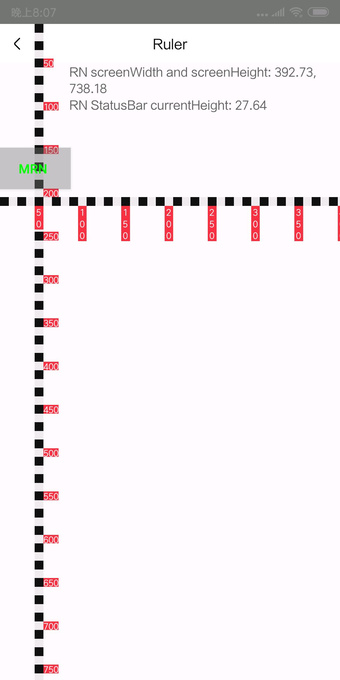
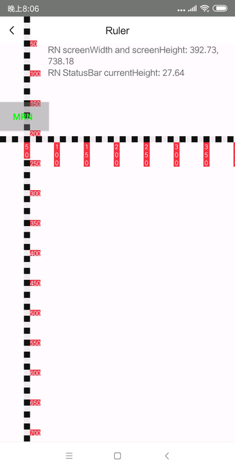
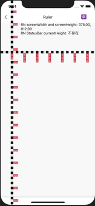

# Ruler

刻度尺组件。因为通过 RN Dimension('window').height 获取的屏幕高度（screenHeight），并不是真正的可视区域的高度，所以，导致弹框类组件（例如：SlideModal），在计算位置时发送错误，通过 Ruler 组件可以测量出真正的屏幕高度。（SlideModal 支持自定义 screenHeight）

该组件只能通过人工的方式，测量屏幕可视区域，如果要彻底解决屏幕的适配问题，还需要借助 Native 侧获取机型信息。基于 Ruler 组件的测量结果和机型信息，提供一个完整的机型信息与可视区域宽高的映射关系表。

## Usage
### 全部引入

```js
import { Ruler } from '@roo/roo-mobile-rn';
```

### 按需引入
```js
import { Ruler } from '@roo/roo-mobile-rn/dist/modules/Ruler';
```

## Examples

**MIX 2无虚拟按键**

该情况下，RN 提供的 screenHeigth 是 738，测量结果是 758 左右。



**MIX 2有虚拟按键**

该情况下，真正的可视区域的计算方式是：RN screenHeight（738） 减去 StatusBar.currentHeight（27）等于 711。与测量结果一致。




**iPhoneX**

通常情况下，screenHeight 与测量的可视区域高度相等。



## Code
[详细 Code](https://github.com/Meituan-Dianping/beeshell/tree/master/examples/Ruler/index.tsx)

```js
import { Ruler } from '@roo/roo-mobile-rn';
<Ruler direction='vertical' />
<Ruler direction='horizontal' />

```

## API
### Props

| Name | Type | Required | Default | Description |
| ---- | ---- | ---- | ---- | ---- |
| style | ViewStyle | false | {} | 样式 |
| direction | string | false | 'vertical' | 刻度尺方向，支持 'vertical' 'horizontal' |
