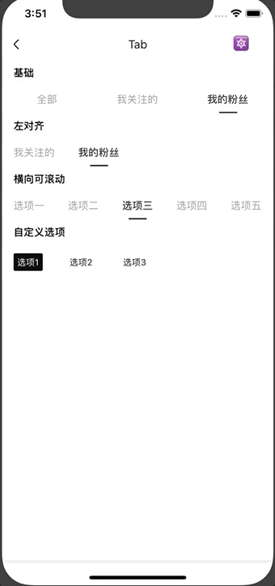

# Tab

标签页组件。

## Usage

### 全部引入
```
import { Tab } from '@roo/roo-mobile-rn';
```

### 按需引入
```
import Tab from '@roo/roo-mobile-rn/dist/components/Tab';
```

## Examples



## Code
[详细 Code](../../examples/Tab/index.tsx)

```jsx
<Tab
  value={1}
  scrollable={true}
  data={[
    {
      value: 1,
      label: '全部'
    },
    {
      value: 2,
      label: '我关注的'
    },
    {
      value: 3,
      label: '我的粉丝'
    }
  ]}
  onChange={(item, index) => {
    console.log(item, index)
  }}
/>
```

## API

### Props

| Name | Type | Required | Default | Description |
| ---- | ---- | ---- | ---- | ---- |
| style | ViewStyle | false | {} | 样式 |
| dataItemContainerStyle | ViewStyle | false | {} | 每一项的容器样式 |
| dataItemStyle | ViewStyle | false | {} | 每一项的样式 |
| activeColor | string | false | variables.mtdGrayDarker | 激活状态颜色 |
| data | Array | true | [] | 数据源，数组元素为对象，必须包含 label 和 value 属性 |
| value | any | false | null | 激活项的值，与数据源某项的 value 相等 |
| onChange | Function | false | null | 状态切换时的回调，参数为数据源的选项和索引 |
| renderItem | Function | false | null | 自定义渲染项，函数参数为 item index active |
